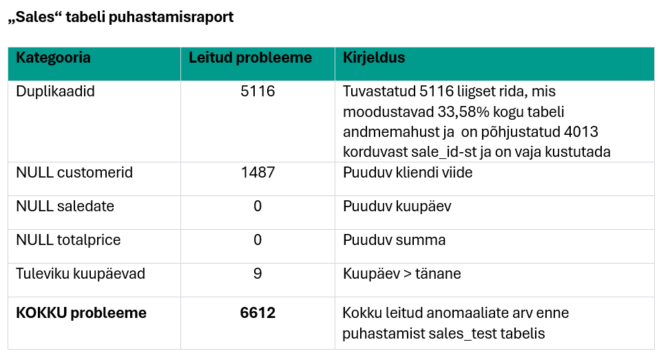
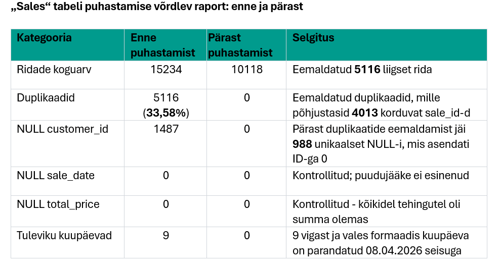

Suurimaks üllatuseks oli see, et 33,58% müügiandmetest ehk 5116 rida olid duplikaadid.

Soovitus Toomasele: esmajärjekorras tuleb eemaldada müügiandmete duplikaadid (5116 rida), kuna need moodustavad 33,58% andmetest ja moonutavad käivet märkimisväärselt.

Puuduvad andmed: Pärast duplikaatide eemaldamist jäi 1487-st puuduvast customer_id-st alles 988 unikaalset tehingut, millel puudub seos kliendiga. Need on asendatud väärtusega 0.

