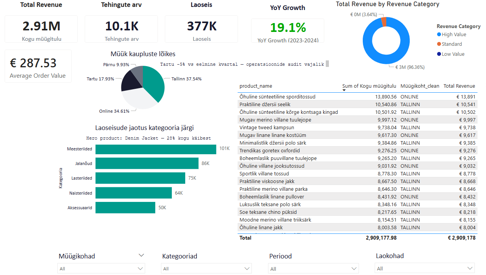

# Nädal 6: Tallinna Kaupluse Dashboard — Storytelling Dashboard

## Minu roll

**Roll A — Tallinna kaupluse dashboard ja narratiiv**

Minu ülesanne oli luua Tallinna UrbanStyle'i kaupluse juhtimisdashboard, mis visualiseerib müügitrende, klientide segmente, populaarsemaid tooteid ja peamisi KPI-sid. Dashboard koostati storytelling-lähenemisega, et juhtkond saaks kiiresti mõista peamisi ärilisi tulemusi ja kasvuvõimalusi.

---

# Äriprobleem

UrbanStyle'i juhtkond vajas selget ülevaadet Tallinna kaupluse tulemuslikkusest, et vastata järgmistele küsimustele:

* Kas Tallinna kaupluse müük kasvab?
* Millised tooted toovad suurima käibe?
* Millised kliendisegmendid loovad kõige rohkem väärtust?
* Kus peitub järgmine kasvuvõimalus?

Eesmärk oli muuta suur hulk müügiandmeid juhtkonnale kiiresti mõistetavaks ja tegevusele suunatud ülevaateks.

---

# Lähenemine

Dashboard loodi kasutades müügi-, kliendi- ja tooteandmeid.

Analüüsi käigus:

* võrreldi 2023 ja 2024 müügitulemusi;
* arvutati peamised KPI-d;
* analüüsiti klientide segmentide osakaalu;
* tuvastati enim müüdud tooted;
* lisati ärilised annotatsioonid ja soovitused.

Visualiseerimine koostati storytelling-põhimõttel, et juhtkond saaks peamised järeldused kiiresti kätte.

---

# Key Insights

### €1M müügipiiri ületamine

Tallinna kauplus saavutas rekordilise üle 1 miljoni euro suuruse käibe.

### 11% aastane müügikasv

2024. aasta müük kasvas võrreldes 2023. aastaga 11%.

### Detsember oli tugevaim müügikuu

Jõulukampaaniad tõid aasta suurima müügimahu ning tõstsid müügi rekordtasemele.

### Bestseller: Praktiline džersi seelik

Kõige suurema käibega toode oli **"Praktiline džersi seelik"**, mis vedas Tallinna kaupluse müügitulemusi.

### 40% tulust tuleb lojaalsusprogrammist väljaspool olevatelt klientidelt

See viitab suurele potentsiaalile kasvatada püsiklientide arvu ja suurendada kliendi eluaegset väärtust.

---

# Tehniline pinurida

* Power BI
* Excel
* DAX
* Data Visualization
* Storytelling Dashboard Design

---

# Ekraanipildid

## Tallinna kaupluse dashboard

Dashboard annab ülevaate:

- peamistest KPI-dest;
- müügikasvust 2023 vs 2024;
- klientide segmentidest;
- Top 5 tootest;
- juhtkonna jaoks olulistest ärisoovitustest.

---

# Äritõlgendus

Dashboard näitas, et Tallinna kauplus on UrbanStyle'i tugevaim müügikanal.

Peamised järeldused:

* hooajalistel kampaaniatel on märkimisväärne mõju müügitulemustele;
* bestseller-tooted loovad suure osa käibest;
* suurim kasvupotentsiaal peitub mitte-lojaalsete klientide konverteerimises püsiklientideks.

---

# Soovitused juhtkonnale

1. Suurendada lojaalsusprogrammi liikmete arvu.
2. Planeerida jõulukampaaniaid varasemalt.
3. Suurendada Q4 bestseller-toodete laoseisu.

---

# How to Run

## Power BI versioon

1. Ava projekt Power BI Desktopis.
2. Ava `.pbix` fail.
3. Vajuta **Refresh**.
4. Ava dashboardi vaade.

## Staatiline versioon

1. Ava PNG või PDF fail projekti kaustast.
2. Vaata dashboardi ilma Power BI-ta.

---

# Õpitu ja väljakutsed

Suurim väljakutse oli leida tasakaal detailse analüüsi ja juhtkonnale sobiva lihtsa visualiseerimise vahel.

Projekti käigus õppisin:

* kasutama storytelling-põhimõtteid dashboardide loomisel;
* rõhutama äriliselt olulisi mõõdikuid;
* lisama visuaalidesse konteksti ja soovitusi, mitte ainult numbreid;
* esitama andmeid viisil, mis toetab juhtimisotsuseid.

---

# AI kasutamine

Kasutasin AI abi:

* dashboardi narratiivi loomisel;
* KPI-de sõnastamisel;
* annotatsioonide ideede genereerimisel;
* README dokumentatsiooni viimistlemisel.

AI ei loonud analüüsi ega ärilisi järeldusi iseseisvalt. Kõik analüüsid, visualiseeringud ja lõplikud soovitused põhinevad minu enda tööl.
