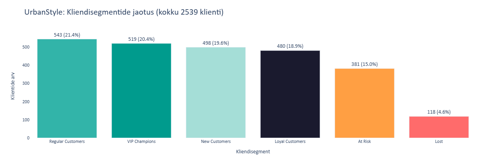
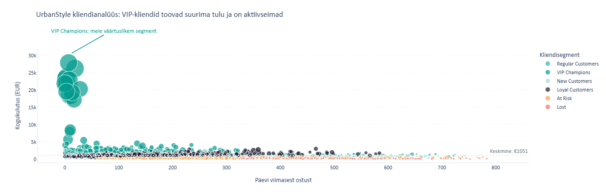
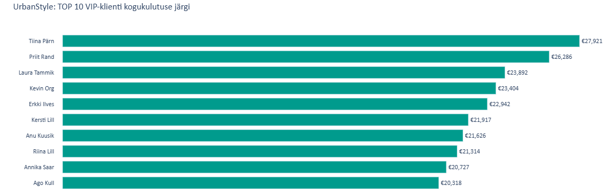

# Nädal 7: Python Pandas — RFM kliendisegmenteerimine

## Projekti eesmärk

Meie meeskond viis läbi UrbanStyle kliendiandmete RFM analüüsi Python pandas abil. Projekti eesmärk oli laadida ja puhastada kliendi- ning müügiandmed, arvutada Recency, Frequency ja Monetary mõõdikud ning leida kõige väärtuslikumad kliendisegmendid ja churn-riskis kliendid.

## Minu roll

**Roll D — Visualization (Visualiseerimine ja äritõlgendus)**

Minu ülesanne oli luua Plotly abil visualiseeringud RFM analüüsi tulemuste esitamiseks ning koostada äritõlgendus ja soovitused Markole. Lõin 3 diagrammi:
- kliendisegmentide jaotuse

- hajuvusdiagrammi klientide ostukäitumise visualiseerimiseks

- TOP 10 VIP kliendi kogukulutuse diagrammi

## Peamised leiud

- **519 VIP Champions klienti (20.4%)** moodustavad UrbanStyle’i kõige väärtuslikuma kliendisegmendi ning nende kogukulutus on oluliselt kõrgem kui teistel klientidel.
- TOP 10 VIP kliendi kogukulutus jäi vahemikku umbes **20 000–28 000 eurot**, mis näitab tugevat käibe koondumist väikese kliendigrupi kätte.
- **381 At Risk klienti (15.0%)** vajavad kiiret tähelepanu, sest nende ostuaktiivsus on langenud ning osa väärtuslikest klientidest võib olla churn-riskis.
- Scatter-diagramm näitas, et VIP kliendid paiknevad madala recency ja kõrge monetary piirkonnas, mis viitab tugevale lojaalsusele ja kõrgele äriväärtusele.
- Segmentide jaotus näitab, et erinevad kliendigrupid vajavad erinevaid turundus- ja kommunikatsioonistrateegiaid.

## AI kasutamine

Kasutasin AI abi Plotly visualiseerimiste täiustamiseks ja kujunduse parandamiseks. AI aitas selgitada Plotly süntaksit, hajuvusdiagrammi kujundamist ning kuidas rakendada Knaflic’u põhimõtteid clutter’i vähendamiseks ja graafikute loetavuse parandamiseks.